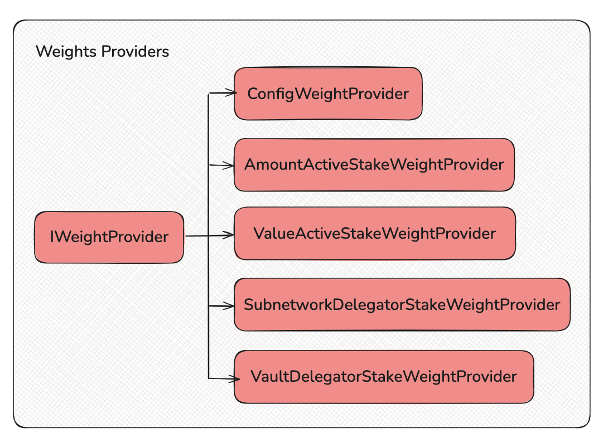

## ⚠️ Disclaimer: This code is NOT intended for a production use. The SDK is a work in progress and will be audited later. Breaking changes may occur in SDK updates as well as backward compatibility is not guaranteed. Use with caution.

## Network Bootstrap

To launch a network based on the Symbiotic protocol, developers need to develop and register a `NetworkMiddleware` management contract, which implements the logic of slashing, reward distribution, vault management, operator management, key managment and etc.
Currently, networks must develop contract integrations independently, requiring a deep understanding of the Symbiotic protocol and significant resource investment.

The Statemind Network SDK is actively reusing/expanding the components of the Symbiotic Middleware SDK and also adding new components.

### Levels

- Framework level - a set of basic components(base managers, libraries) of the Statement SDK and Symbiotic SDK
- Component level - a set of extended components (extensions) implemented in the Statemind SDK.
Flexible and extendable. Developers can implement new components or extend existing.
- Implementation level - a set of ready-made `NetworkMiddleware` implementations for deployment.
The library will provide more `NetworkMiddleware` implementations depending on the types of behavior strategies.

## Components:

* `ProxyRewards` - provides an ABI to distributing rewards using `DefaultOperatorRewards`, `DefaultStakerRewards` without a custom strategy inside.
* `WeightedRewards` - automated distribution of the rewards of stakers based on the set implementation `IWeightProvider`. Supported providers: `ConfigWeightProvider`, `AmountActiveStakeWeightProvider`, `ValueActiveStakeWeightProvider`.

* `FlexibleSlasher` - provides an ABI to slashing when the administrator specifies parameters(vault, subnetwork, operator, amount) manually.
* `SubnetworkSlasher` - strategy for distributing the slash amount among vaults within a specific subnetwork for the specified operator.
Supported providers: `ConfigWeightProvider`, `AmountActiveStakeWeightProvider`, `ValueActiveStakeWeightProvider`, `VaultDelegatorStakeWeightProvider`.
* `VaultSlasher` - strategy for distributing the slash amount among vaults within a specific vault for the specified operator.
Supported providers: `ConfigWeightProvider`, `SubnetworkDelegatorStakeWeightProvider`.
* `CommonSlasher` - strategy for distributing the slash amount among vaults and subnetworks for the specified operator. Vault weight provider and subnetwork weight provider can be specified.
* Supported vault weight providers: `ConfigWeightProvider`, `AmountActiveStakeWeightProvider`, `ValueActiveStakeWeightProvider`, `VaultDelegatorStakeWeightProvider`.
* Supported subnetwork weight providers: `ConfigWeightProvider`, `SubnetworkDelegatorStakeWeightProvider`.

* `PriceProvider` - an aggregator of price adapters that provides prices for tokens. Contracnt can use different oracles (Chainlink, Red Stone)
* `IPriceAdapter` - a single interface for abstracting a implementation and a oracle type.
* `ChainlinkPriceAdapter` - Chainlink implementation for getting prices. Support price feeds push model.
* `RedstonePriceAdapter` - Readstone implementation for getting prices. Support price feeds push model.
* `TwoPathChainlinkAdapter` - Chainlink implementation for getting prices when there is no direct oracle in the base currency. The price is calculated using oracles by intermediate assets.

* `IPriceAdapter` - a single interface for abstracting weight calculating approach.
* `ConfigWeightProvider` - weights are set by the administrator for Vaults or Subnetworks.
* `AmountActiveStakeWeightProvider` - weights based on the Vault active stake amount. Using if collateral same for all vaults.
* `ValueActiveStakeWeightProvider` - weights based on the value in the base currency of the Vault active stake. Using if collateral different for vaults.
* `SubnetworkDelegatorStakeWeightProvider` - weight based on the delegator stake amount for provided subnetworks for single vault.
* `VaultDelegatorStakeWeightProvider` - weight based on the delegator stake amount for the provided vault and agregated by subnetworks. Supported raw amount and calculation value based on base currency prices.

Operators receive rewards regardless of the stakers rewards(without weight abstractions). Based on `DefaultOperatorRewards`.
